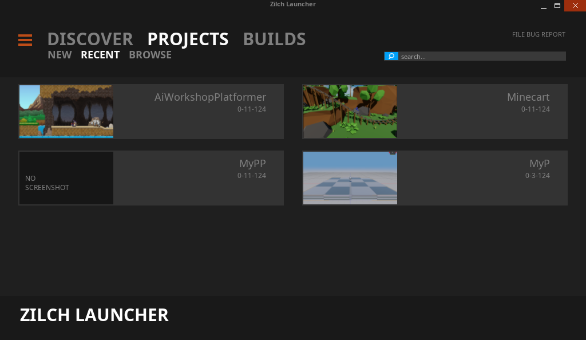

# Release Notes - 0.9.0-beta

This is the first public beta release of [ZilchEngine](https://zilchengine.com), a cross-platform light-weight 2D and 3D game development engine.
ZilchEngine is being released under the [MIT license](https://github.com/ZilchEngine/ZilchEngine/blob/master/LICENSE.md).
While ZilchEngine is just being released, its lineage goes back to the ZeroEngine developed by the DigiPen univeristy. Click [here](./zeroengine.md) to learn more about that history.

ZilchEngine itself has been in development for almost a year, improving on the core that is ZeroEngine. It is now in a place where other developers can start playing with it.

Below is a short breakdown of some of the current features.

For an in-depth dive into all the engine features, please check out the [documentation](https://zilchengine.com/docs). 

## Features

**A Discrete Launcher**
The launcher is the entry point into ZeroEngine. It is used to manage different versions of ZeroEngine, as well as managing your ZeroEngine projects.

-> *** Launcher - Projects *** <-

*** Launcher - Editor Builds ***

**Editor**
A powerful and flexible editor with editor modes customized for 2D and 3D projects.
It also comes with a full-featured text editor with dozens of hotkeys and configuration options.

*** Editor 3D Mode ***

*** Editor 2D Mode ***

**Engine**

*Architecture*
Component-based architecture applied across the engine in the form of :
- NadaComponents for game object behaviors
- NadaFragment for fragment, vertex, and geometry shaders
- ContentComponents for Resources meta data

*Graphics*
- Fully modifiable, scripted rendering pipeline
- With a physically-based renderer provided as the default renderer
- Dedicated render thread

*Physics*
- Custom-built, three-dimensional, constraint-based physics engine
- Regions that can apply both pre-defined and user-defined PhysicsEffects
- Robust, customizable joint system

*Audio*
- Scripted, node-based DST system
- 3D sound positioning and attenuation

*Scripting*
- High-level scripting and shader language

*Networking*
- One-click network replication

*Plugins*
- Extend the engine with C++ plugins

For a deeper dive into all the available features, check out the comprehensive documentation available [here](https://zilchengine.com/docs).

## Supported Platforms

As of 0.9.0-beta, the only officially supported platform is **Windows**.
There is experimental support for **Linux** and the **Web**(via emscripten).

Support for **Android**, **iOS**, and other platforms will come in a future release.

## Getting Started with ZeroEngine

### Windows

To get started with ZeroEngine, you can download the beta version of the launcher for Windows [here](https://github.com/ZilchEngine/ZilchEngine/releases).
This version of the launcher comes with the initial version of the engine pre-packaged.
In the future, you will be able to download engine updates directly from the launcher.

### Linux

To get started on Linux, you need to build the engine from source. 
Follow the build instructions on the [Github repo](https://github.com/ZilchEngine/ZilchEngine) to build and package the launcher and engine.
Binary packages will be distributed for various linux distributions with version 1.0.0 and subsequent releases.

### Samples

After you have download the engine, you'll likely want some samples to play around with.
Follow [this link](https://github.com/ZilchEngine/ZilchEngineSamples) to the samples repository where you can download various samples.

In the future, you'll be able to find and download samples directly from the launcher.

## Documentation & Tutorials

Finally, you'll want to check out the [Documentation and Tutorials](https://zilchengine.com/docs) 

# Road to 1.0

Below is a short list of items that need to be completed before the 1.0 release.

- Material import (In progress)
- 

## Q & A

Q: There are already multiple engines available, like Unity, Unreal, O3DE, etc... Why bother with this engine?
A: I would like to categorically rule out non-open source engines for now and discuss why ZilchEngine and not other open source engines.
   Most open source engines I've come across are either incomplete, poorly documented, or have limitations which make them non-starters for my use-cases.
   I wanted an engine that has strong support for both 2D and 3D game development, has a usable editor, and supports multiple platforms.
   Of course, I want the engine to be completely open source (Preferable MIT, BSD, or Apache2 licensed). This rules out the source-available engines.
   With just those few requirements, the pickings already become slim.
   Lets talk about a few of the contenders (in no particular order) and why they don't fit the bill.
   
   Stride: Editor is not cross platform. Supporting C# on all the platforms I want to target (Android, iOS, Web) is a nightmare.
   
   LumixEngine: Not intended for mobile development.
   
   Cocos Creator: Great platform support, and complet feature set. However, editor is closed source.
   
   O3DE: Too bulky, and no 2D support to speak of.
   
   Defold: Great 2D support, paltry 3D support at the moment.
   
   MonoGame/XNA: Not complete engines.
   
   Godot: This is the most complete option, and also the closest to ZilchEngine in many ways, so I can give an in-depth comparison of the two. 
   Godot developers have made some technical decisions which I believe leaves a lot of performance on the table.
   These decisions are fundamental to the engine and not something I can change as a user. This is ingrained in the way the scenegraph is architected.
   The node-base architecture favours inheritance and deep inheritance hierarchies for certain nodes. Some nodes have redundant data due to the design.
   For example, every node has transform data, even if that transform data is never used. Say you want to construct a physical entity in the scene.
   You could start with a RigidBody3D, which has a MeshInstance3D as a child. Of course, you'll also need a CollisionShape3D as a child of the rigid body.
   With this setup, All three nodes have transform data, even though it most cases it is only useful on the parent RigidBody3D node. The useless data on
   nodes multiple adds up when you have many such compositions in the scene.
   ZilchEngine engine on the other hand, utilizes a component-based architecture. Achieving a similar composition to the one described above would take just
   a Cog (game object), a Transform, a RigidBody, a Model, and a Collider component. Each component has just the data it needs to fulfill its required functionality.
   This makes compositions in ZilchEngine a lot more light weight. It also makes it more convenient to refactor your compositions, since you have a flat structure rather than an hierarchy.   
   Similar to how the node-based architecture is fundamental to Godot, the component-based architecture is fundamental to ZilchEngine. 
   
   Both engines utilize their in-house scripting languages which enjoy deep integration into the engines. Godot's GDScript has pythonic syntax and some semantics,
   Zilch's Nada resembles the C family and looks like a mix of C# and TypeScript. I prefer the C family over GDScript.
   
   Both engines also have their in-house physics engines. Godot's 3D physics engine is notorious for being bad. However, there is a Jolt plugin which is expected to be merged into Godot proper.
   Zilch's physics engine can operate in both 3D and 2D mode, and has worked very well for everything I've thrown at it.
   
   Both engines have a custom UI framework, which is used to develop the editor. Godot's UI framework seems more mature. Improving Zilch's is planned for a future release.
   
   Godot supports more platforms. ZeroEngine currently only supports Linux, Windows, and the Web. Android and iOS support are planned for a future release.
   
   Godot supports Vulkan, D3D12, and will support Metal in the future. Zilch only supports OpenGL currently. Vulkan, Metal, and WebGPU support are planned for a future release.
   
   Both engines can be extended via C++ plugins. The plugins can expose functionality to any scripting language that the engines enable. 
   The workflow for C++ plugins in Zilch is nicer IMO (at least on Windows) as almost everything can be done via the editor (this will be extended to Linux in the future).
   
   Overall, I think Godot is a more mature and feature-complete engine. However, I think Zilch is better designed, and more flexible
   
   With all that being said, I am not making any claims that ZilchEngine is better than Godot. Each engine has their strengths and weaknesses. It's just that
   ZilchEngine's strengths better align with the way I want to develop games.
   
   Why not source-available or proprietary engines?
   I want absolute freedom when it comes to the engine I use. It's as simple as that.
   Check out the [Documentation](https://zilchengine.com/docs) to learn more about ZeroEngine.

Q: Will ZilchEngine support C#?
A: There are no immediate plans to support C#. However, if someone contributes C# support then I will not be opposed to it.
   Additionally, if there is demand for C# support, then it may be added to some future roadmap.